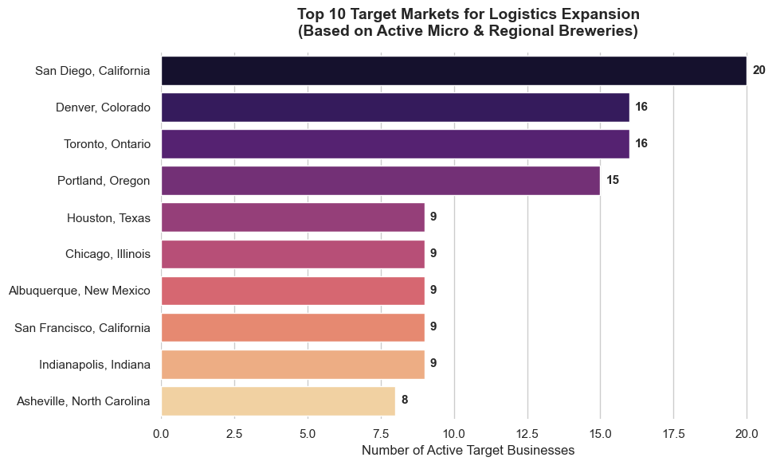

# 🍻 Strategic Market Expansion: Brewery Distribution Analysis

### 🎯 Objective
A craft beverage logistics company is looking to expand its distribution network and needs to determine the optimal location for a new warehouse. The goal of this project was to analyze the geographical density of active micro and regional breweries across North America to identify the most lucrative target market.

### 🛠️ Methodology & Technical Stack
This project utilized Python and the **Open Brewery DB API** to extract, clean, and aggregate business data.

* **API Pagination:** Engineered a data extraction loop to pull thousands of records across multiple API pages while implementing polite sleep timers to avoid rate-limiting.
* **Data Cleansing:** Filtered out 'closed' and 'planning' locations to ensure the analysis only included active, viable logistics targets. 
* **Strategic Aggregation:** Utilized Pandas `.groupby()` to aggregate business density at both the macro (State/Province) and micro (City) levels, preventing data collisions between cities with the same name across different states.
* **Data Visualization:** Built presentation-ready horizontal bar charts using `seaborn` and `matplotlib` to clearly communicate the business recommendation.

### 📊 Visualization: Top 10 Target Markets

### 💡 Key Business Insights
After analyzing the active micro and regional brewery market, the data points to a very clear geographical strategy:
1. **The West Coast Dominates:** **San Diego, CA (20)** is the undisputed optimal location for the new warehouse, offering the highest density of potential clients. 
2. **Secondary Hubs:** If the company is looking for a multi-warehouse expansion, **Denver, CO (16)** and **Toronto, ON (16)** offer incredibly strong secondary markets.
3. **The Pacific Northwest:** Portland, OR (15) remains a highly competitive market, rounding out the top-tier distribution hubs.